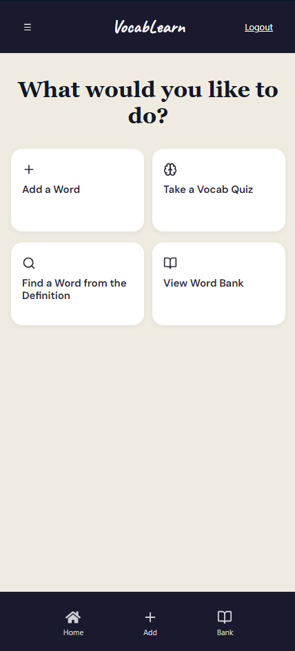
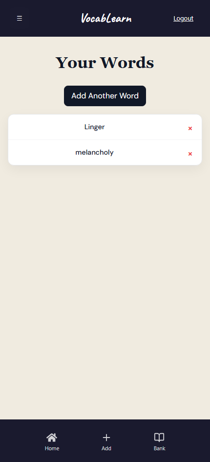
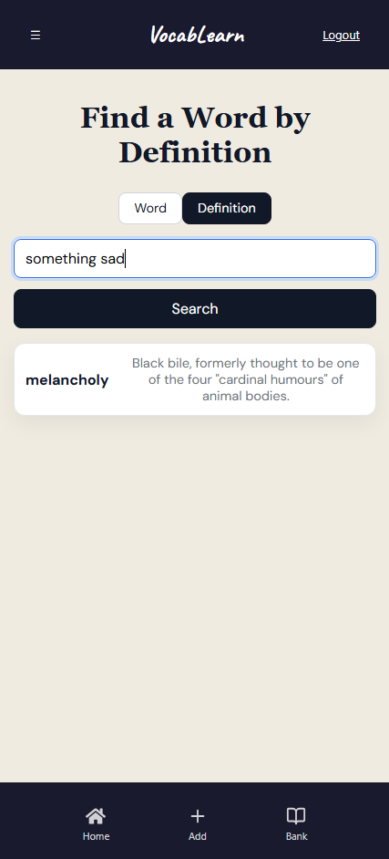

# VocabLearn

VocabLearn is a full-stack vocabulary practice app with a quiz loop, saved word bank, reverse-dictionary search, and AI-assisted word generation. It is built to help users learn new words through repeated practice instead of one-off lookup.

## Live Demo

- Frontend: [https://vocab-learn-frontend.onrender.com](https://vocab-learn-frontend.onrender.com)
- Backend: [https://vocab-learn-api.onrender.com](https://vocab-learn-api.onrender.com)

## Screenshots

### Homepage

### Word Bank

### Reverse Search

## What It Does

- Lets users add words manually or generate them with AI
- Stores a personal word bank for later practice
- Quizzes users on saved words and tracks accuracy over time
- Supports reverse-dictionary style lookup from prompts or definitions

## Tech Stack

- Frontend: React, Vite, React Router
- Backend: Node.js, Express, MongoDB, Mongoose
- Auth and security: JWT, bcrypt
- AI integration: Google Generative AI
- Tooling: ESLint, Mocha, Chai, C8

## Highlights

- Full-stack authentication and user-specific data
- Quiz flow with progress tracking
- Search and generation workflows for vocabulary discovery
- Deployment automation with GitHub Actions and Render

## Architecture

- Frontend: React SPA built with Vite, organized into reusable components and route-based pages
- Backend: Express API that handles authentication, vocabulary CRUD, quiz logic, and AI-assisted generation
- Data layer: MongoDB with Mongoose models for users and saved words
- Integration: Frontend calls the API through a dedicated config layer, keeping network details isolated from UI code
- Deployment: Separate frontend and backend deployments with CI/CD automation through GitHub Actions and Render

## Personal Contributions

- Led development of VocabLearn, owning the core frontend, backend, authentication, quiz flow, and deployment
- Built and connected the core vocabulary flows between the frontend and backend
- Implemented the quiz experience and saved-word interactions
- Added authentication and protected user data handling
- Shaped the deployment and developer workflow for local setup and production hosting

## Future Improvements

- Add spaced repetition to improve long-term retention
- Expand quiz modes with timed challenges and mixed difficulty sets
- Add progress dashboards and streak tracking for motivation
- Improve reverse search results with richer definitions and examples
- Support exporting saved words for offline study or sharing

## Setup

For local setup and testing, see [CONTRIBUTING.md](CONTRIBUTING.md).
